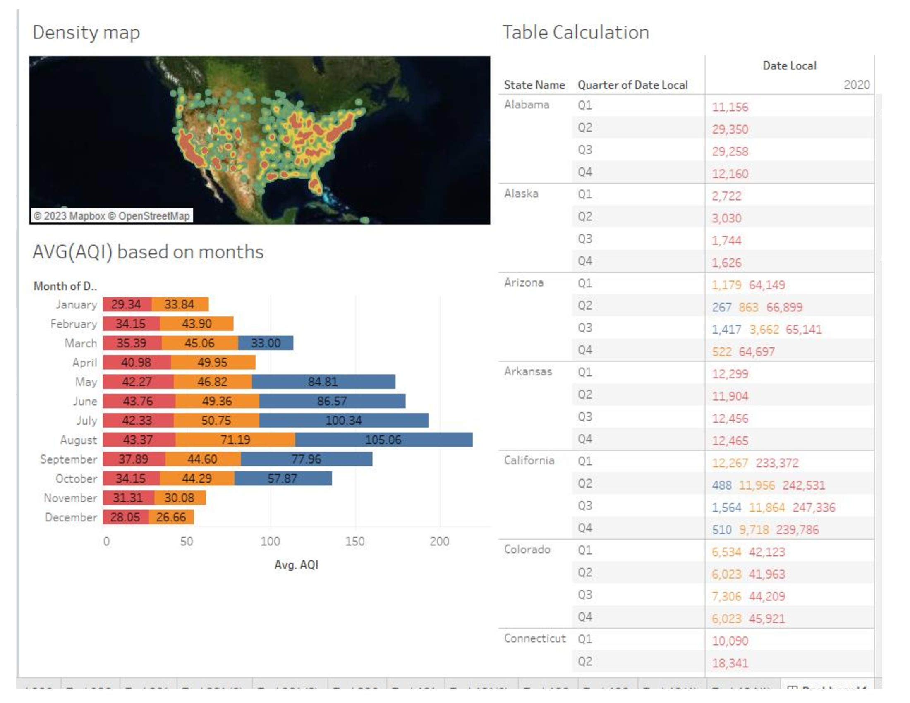

# **Air Quality Data Visualization**

## **Introduction**
This project focuses on visualizing air quality data collected from the **EPA's Air Quality System (AQS)**. The AQS receives data from various data collection agencies and generates aggregate summaries, such as daily and annual data. The project aims to explore, analyze, and visualize this data using advanced data visualization techniques and geospatial analysis.

---

## **Table of Contents**
1. [Features](#features)
2. [Team Members](#team-members)
3. [Tasks](#tasks)
   - [Data Preprocessing](#data-preprocessing)
   - [Visualizations](#visualizations)
   - [Geospatial Analysis](#geospatial-analysis)
   - [LOD Expressions](#lod-expressions)
   - [Dashboard Creation](#dashboard-creation)
4. [Acknowledgements](#acknowledgements)

---

## **Features**
- Creation of hierarchies for city, country, and state data.
- Visualization of single variables (categorical and continuous).
- Analysis of relationships between continuous variables.
- Geospatial visualizations using point, density, and filled maps.
- Use of advanced analytical tools such as LOD (Level of Detail) expressions, calculated fields, and table calculations.
- Creation of an interactive dashboard for data exploration.

---

## **Tasks**

### **1. Data Preprocessing**
- Changed data types for compatibility:
  - State Code and Country Code converted from `Number` to `String`.
- Created hierarchies for:
  - **City**: Address, City Name.
  - **Country**: Country Code, Country Name.
  - **State**: State Code, State Name.

---

### **2. Visualizations**
#### **Task 1: Single Variable Visualizations**
- **Q1**: Count the number of observations based on event type.

#### **Task 2: Two Continuous Variables**
- **Q2**: Compare the number of observations with the highest AQI within event types.

#### **Task 3: Mixed Variable Visualizations**
- **Q3**: Compute the average AQI by month.

---

### **3. Geospatial Analysis**
#### **Using Maps**
- **Q1.1**: Visualizing the maximum AQI by city name (Point map).  
- **Q1.2**: Locate the site with the highest average AQI (Density map).  
- **Q1.3**: Define event types for each state on the map (Filled map).  
- **Q2**: Identify high and low AQI cities using four visual attributes.

---

### **4. Advanced Analytics**
#### **LOD Expressions**
- **Q1.1**: Identify the state with the highest average AQI by event type.  
- **Q1.2**: Compute the sum and average AQI for each state using LOD expressions.

#### **Calculated Fields**
- **Q2**: Count the AQI for each state across all months.

#### **Table Calculations**
- **Q3**: Show the number of observations for each quarter of 2020 across all states.

#### **Filters**
- **Q4.1**: Exclude the event type "None" using filters.  
- **Q4.2**: Show all countries with AQI ≥ 40,000 using filters.

---

### **Dashboard Creation**
An interactive dashboard was created to visualize and explore the air quality data, combining multiple charts and geospatial maps for deeper insights.

---
